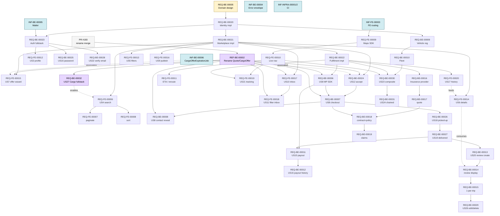

# Dependency Graph

Source of truth for **execution order and parallelization** across all tracked issues. Status of each issue (Backlog / Ready / InReview / Done) lives in [`ISSUES-INDEX.md`](ISSUES-INDEX.md) and in the folder layout under `.gdsi-sdlc/issues/`. This doc tracks the **edges** (what blocks what) — update it when an issue is created, retitled, deleted, or when a dependency changes.

> **Update rule**: every PR that adds, removes, or re-scopes an issue updates this doc in the same change. Drift between this doc and the actual issue files counts as a defect.

## Tier 0 — In flight (InReview)

These have to clear first; everything in Tier 1 waits on `REQ-BE-00005`.

| TAG | Title | Why it's first |
|-----|-------|----------------|
| `REQ-BE-00005` | Diseñar modelo de dominio inicial | Unblocks all model implementation |
| `INF-BE-00003` | Agregar ActiveAdmin al backend | Read-only inspection of new models in Tier 1 |
| `REQ-DOC-00002` | Artefacto de riesgos | Doc deliverable, no code dependency |
| `REQ-FE-00002` | Cronograma | Doc deliverable, no code dependency |
| `INF-GEN-00001` | Throughput projections (RDY) | Tooling, no code dependency |
| `INF-BE-00001` | Reestructurar WBS por funcionalidades (RDY) | Doc artifact, no code dependency |

## Tier 1 — Foundation (P0/P1, blocks all features)

```
REQ-BE-00005 (design, IR)
  └─▶ REQ-BE-00020  Identity impl ─┬─▶ REQ-BE-00023  Auth fullstack
                                   └─▶ REQ-BE-00021  Marketplace impl
                                        └─▶ REQ-BE-00022  Fulfilment impl
```

| TAG | Title | Blocks |
|-----|-------|--------|
| `REQ-BE-00020` | Identity models impl | All `/me/*` endpoints, every feature with role gating |
| `REQ-BE-00021` | Marketplace models impl | Search, offer, accept, publish |
| `REQ-BE-00022` | Fulfilment models impl | Pickup, delivery, tracking, payout, reviews, insurance |
| `REQ-BE-00023` | Auth fullstack (US1+US2) | All `/me/*` features |

## Cross-cutting (parallelizable from day 1)

No dependencies on Tier 1 — can be picked up immediately.

| TAG | Title | Blocks (when un-done) |
|-----|-------|------------------------|
| `INF-BE-00004` | API error envelope + base controller | Standardizes shape — feature endpoints can proceed without, but rework is cheap if landed early |
| `INF-BE-00005` | ActionMailer + Solid Queue scaffolding | Auth welcome, payment notifications, payout failures, review CTAs, insurance emails, claim updates |
| `INF-FE-00003` | React Router + App.tsx split | Every FE feature issue |
| `INF-INFRA-00001` | Move CI workflows to repo root | Future Frontend CI |
| `INF-INFRA-00002` | Frontend CI (Vitest + Playwright) | Quality gate; doesn't block features but degrades trust |

## Tier 2 — Feature streams

Each row is one independent stream. Within a stream, follow the arrows. Across streams, the work is parallelizable provided Tier 1 deps are met.

### Account stream
```
REQ-BE-00023 (Auth) ─┬─▶ REQ-FE-00012  (US3 edit profile)
                     ├─▶ REQ-BE-00025  (US16 change password)
                     └─▶ REQ-BE-00028  (US22 email verification)
```

### Vehicle stream
```
REQ-BE-00020 (Identity) ─▶ REQ-BE-00009 (vehicle reg + photos)
                            └─▶ REQ-BE-00010 (multi-vehicle / fleet)
```

### Shipper-side discovery stream
```
REQ-BE-00021 (Marketplace) ─┬─▶ REQ-FE-00006  (US4 search base)
                            │     ├─▶ REQ-FE-00007  (paginate)
                            │     └─▶ REQ-FE-00008  (sort)
                            ├─▶ REQ-FE-00013  (US5 filter carriers)
                            ├─▶ REQ-FE-00014  (US6 carrier details)
                            │     └─needs ▶ REQ-BE-00014  (avg rating display in profile)
                            └─▶ REQ-FE-00015  (US7 offer wizard)
                                  └─▶ triggers REQ-BE-00024 (carrier accepts) eventually
```

### Carrier-side stream
```
REQ-BE-00021 (Marketplace) ─┬─▶ REQ-FE-00016  (US9 publish availability)
                            ├─▶ REQ-FE-00017  (US10 offers inbox)
                            │     └─▶ REQ-FE-00018  (US11 filter inbox)
                            └─▶ REQ-BE-00024  (US12 accept trip)
                                  ├─▶ REQ-BE-00007  (US8 checkout flow — needs MP integration)
                                  └─▶ creates Shipment → unlocks lifecycle stream
```

### Payment stream
```
REQ-BE-00022 (Fulfilment) ─┬─▶ REQ-BE-00006  (US8 MP integration / SDK)
                           │     ├─▶ REQ-BE-00007  (checkout flow on accept)
                           │     │     └─▶ REQ-BE-00008  (reveal carrier contact post-pago)
                           │     └─▶ REQ-BE-00011  (US15 carrier payout)
                           │           └─▶ REQ-BE-00012  (payout history view)
                           └─▶ REQ-BE-00018  (insurance contract — same checkout extension)
```

### Trip lifecycle stream
```
REQ-BE-00024 (accept) ─▶ Shipment exists
                          ├─▶ REQ-BE-00007 (cliente paga → Shipment.accepted)
                          │     └─▶ REQ-BE-00026 (US18 mark picked-up)
                          │           └─▶ REQ-BE-00027 (US19 mark delivered)
                          │                 ├─▶ REQ-BE-00011 (payout, queued)
                          │                 ├─▶ REQ-BE-00013 (review window opens)
                          │                 └─▶ REQ-BE-00018 (insurance policy emit, if contracted)
```

### Maps + tracking stream
```
INF-FE-00003 (FE routing) ─▶ REQ-FE-00009  (US13 Maps SDK)
                              ├─▶ REQ-FE-00010  (live nav + GPS push to BE)
                              │     └─▶ REQ-FE-00011  (ETA + reroute)
                              └─▶ REQ-FE-00019  (US21 tracking page — also needs REQ-BE-00022)
```

### Reviews stream
```
REQ-BE-00027 (delivered) ─▶ REQ-BE-00013  (US20 review create)
                              └─▶ REQ-BE-00014  (display + avg)
                                    └─▶ REQ-BE-00015  (1-per-trip enforcement)
                                          └─▶ REQ-BE-00029  (US26 edit / delete review)
```

### Insurance stream
```
REQ-BE-00022 (Fulfilment) ─▶ REQ-BE-00016  (US25 provider integration)
                              └─▶ REQ-BE-00017  (quote on declared value + distance)
                                    └─▶ REQ-BE-00018  (contract + policy emission)
                                          └─▶ REQ-BE-00019  (claims declaration + tracking)
```

### History stream
```
REQ-BE-00022 (Fulfilment) ─▶ REQ-FE-00020  (US17 history — uses TrackingEvent timeline)
                              └─needs ▶ REQ-FE-00014 to consume the public-history endpoint
```

### Advanced trip ops (Release 3)
```
REQ-BE-00009 + REQ-BE-00010 + REQ-BE-00022 + REQ-FE-00009/10
  ─▶ REQ-BE-00030  (US23 composite trips — multi-pickup/delivery)
       └─▶ REQ-BE-00031  (US24 chained orders — sequential routes)
```

### Cargo rename + Cargo-scoped flow (added 2026-05-19)

After the `Quote → CargoOffer` and `CargoOffer → Cargo` rename, the US flow is reframed to be **Cargo-scoped**: a Shipper publishes a `Cargo` (US27), which feeds the matches view (US4), narrows via filters (US5), drills into Carrier details (US6), and finally spawns one or more `pending` `CargoOffer`s through the offer wizard (US7). One `Cargo` can spawn many `pending` `CargoOffer`s against different `Window`s; the first Carrier accept wins and siblings are auto-`rejected` in the same DB transaction (US12).

> **External blocker**: PR #193 (codebase rename merge resolution) blocks `REF-BE-00002`. Not a graph node — tracked outside `.gdsi-sdlc/issues/`.

```
[PR #193 merge] ─▶ REF-BE-00002  (codebase rename: Quote→CargoOffer, CargoOffer→Cargo)
                     ├─▶ REQ-BE-00032  (US27 Cargo model + endpoints + "Mis cargas" UI)
                     │     └─enables ▶ REQ-FE-00006  (US4 — matches feed at GET /api/cargos/:id/matches)
                     │           └─▶ REQ-FE-00013  (US5 filter)
                     │                 └─▶ REQ-FE-00014  (US6 carrier details)
                     │                       └─▶ REQ-FE-00015  (US7 offer wizard — spawns pending CargoOffers)
                     │                             └─▶ REQ-BE-00024 (US12 accept — first wins, siblings auto-rejected)
                     ├─▶ REQ-BE-00024  (US12 accept — references renamed CargoOffer/Cargo)
                     ├─▶ REQ-BE-00007  (US8 checkout — references renamed entities)
                     ├─▶ REQ-BE-00008  (US8 contact reveal — references renamed entities)
                     ├─▶ REQ-BE-00006  (US8 MP checkout — references renamed entities)
                     ├─▶ REQ-FE-00015  (US7 wizard — UI consumes renamed JSON keys)
                     ├─▶ REQ-FE-00017  (US10 inbox — lists renamed CargoOffers)
                     └─▶ REQ-FE-00018  (US11 inbox filter — filters over renamed CargoOffers)

INF-BE-00006  (CargoOfferExpirationJob — Solid Queue 48h auto-expire + Window flip)
   ·.associated.·▶ REQ-FE-00015 (US7)   ·.associated.·▶ REQ-BE-00024 (US12)
   (soft / non-blocking: lifecycle support for the 48h auto-expire path)
```

| TAG | Title | Blocks |
|-----|-------|--------|
| `REF-BE-00002` | Rename `Quote`/`CargoOffer` across models, tables, AA, specs, seeds (Ready, waits on PR #193 merge) | `REQ-BE-00032`, `REQ-BE-00024`, `REQ-BE-00007`, `REQ-BE-00008`, `REQ-BE-00006`, `REQ-FE-00015`, `REQ-FE-00017`, `REQ-FE-00018` — any issue whose AC mention the renamed entities |
| `REQ-BE-00032` | US27 fullstack: `Cargo` model + endpoints + "Mis cargas" UI (Backlog) | Enables `REQ-FE-00006` (US4 matches feed) |
| `INF-BE-00006` | `CargoOfferExpirationJob` — Solid Queue 48h auto-expire + Window flip (Backlog) | Non-blocking; soft-associated with US7 (`REQ-FE-00015`) and US12 (`REQ-BE-00024`) |

## Visual (Mermaid)



## Parallelization plan (6 people)

### Sprint 1 — Foundation (narrow funnel)
- **1 dev**: finish `REQ-BE-00005` review/merge (in flight).
- After merge, fan out:
  - `REQ-BE-00020` (Identity impl) — 1 dev
  - `REQ-BE-00021` (Marketplace impl) — 1 dev (can start models without endpoints in parallel with Identity)
  - `INF-BE-00004` (error envelope) — 1 dev
  - `INF-BE-00005` (mailer) — 1 dev
  - `INF-FE-00003` (FE routing refactor) — 1 dev
  - `REQ-BE-00022` (Fulfilment impl) — kicks off when Marketplace lands

### Sprint 2 — Auth + first user-facing slices
- `REQ-BE-00023` (Auth fullstack) — 1 dev (when Identity is mergeable)
- `REQ-BE-00009` (vehicle reg) — 1 dev (BE+FE)
- `REQ-FE-00006` (search base) + `REQ-FE-00007/8` — 1-2 devs
- `REQ-FE-00016` (publish window) — 1 dev
- `REQ-FE-00017` (carrier inbox) — 1 dev

### Sprint 3 — Transaction loop closes
- `REQ-FE-00014` (US6 details) — 1 dev
- `REQ-FE-00015` (US7 offer wizard) — 1 dev
- `REQ-BE-00024` (US12 accept) — 1 dev
- `REQ-BE-00006` (MP integration) — 1 dev
- `REQ-BE-00007` (checkout flow) — 1 dev (depends on MP integration mergeable)
- `REQ-BE-00008` (contact reveal) — small, fold into checkout dev

### Sprint 4 — Lifecycle + payouts
- `REQ-BE-00026` (mark picked-up), `REQ-BE-00027` (mark delivered) — 1 dev (related, fold)
- `REQ-BE-00011` (payout) — 1 dev
- `REQ-BE-00012` (payout history) — small, fold with payout
- `REQ-FE-00009` (Maps SDK), `REQ-FE-00010` (live nav) — 1-2 devs
- `REQ-FE-00019` (tracking page) — 1 dev (after Maps SDK)
- `REQ-FE-00011` (ETA/reroute) — 1 dev

### Sprint 5+ — Tail features
- Reviews stream (`REQ-BE-00013/14/15`, then `REQ-BE-00029`) — 1 dev across the chain
- Insurance stream (`REQ-BE-00016/17/18/19`) — 1-2 devs across the chain
- `REQ-FE-00020` (history)
- `REQ-FE-00012` / `REQ-BE-00025` / `REQ-BE-00028` (account tail)
- `REQ-BE-00030/31` (composite/chained trips, Release 3 — defer)

### What never blocks the critical path
- `INF-INFRA-00001/2` (CI) — independent, lands when convenient
- `INF-BE-00001` (WBS restructure doc) — doc-only
- All Done issues (no further action)

## Stream owner suggestions (informal)

Six devs, one stream-DRI each is a reasonable assignment — the DRI doesn't *only* work that stream, but they own its coherence:

1. **Identity / Auth / Account** stream (foundation-heavy)
2. **Marketplace / Search / Discovery** stream (Shipper-side UI)
3. **Carrier-side** stream (publish, inbox, accept, vehicle)
4. **Payments / Insurance** stream (heavy integration)
5. **Maps / Tracking / Lifecycle** stream (Shipment state + GPS)
6. **Reviews / History / Cross-cutting** stream (the rest + INF tickets)

The split is rough — adjust based on team strengths.

## Legend

- `─▶` blocks (dep arrow).
- `─.consumes.─▶` reads from / displays data of (soft dependency, not blocking).
- `─enables─▶` upstream ships an API/UI the downstream consumes (hard, but only the consumer part is blocked).
- `·.associated.·▶` logically related lifecycle support; non-blocking.
- **Tier 0** — must merge before any Tier 1.
- **Cross-cutting** — no Tier 1 dependency; pick up any time.

## Related

- [`ISSUES-INDEX.md`](ISSUES-INDEX.md) — flat index with current status.
- [`docs/onboarding/06-roadmap.md`](../onboarding/06-roadmap.md) — higher-level live-vs-planned narrative.
