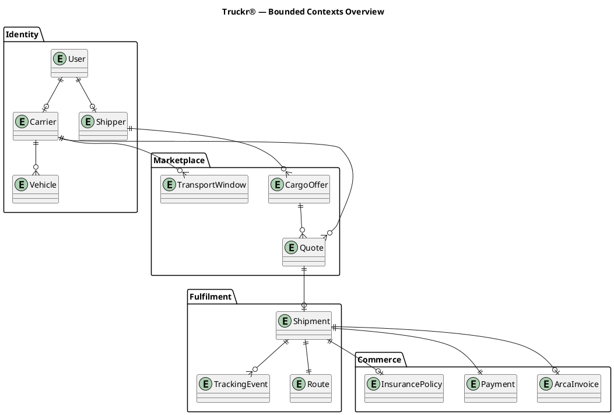

# REQ-BE-00005: Diseñar modelo de dominio inicial (Identity bounded context primero)

| Field | Value |
|-------|-------|
| **Tag** | REQ-BE-00005 |
| **Title** | Diseñar modelo de dominio inicial (Identity bounded context primero) |
| **Priority** | P1 |
| **Status** | READY |
| **Created** | 2026-05-03 |
| **Updated** | 2026-05-03 |
| **Author** | Claude Code |
| **Depends On** | None (puede correr en paralelo con `INF-BE-00003` ActiveAdmin, pero la decisión `User ↔ AdminUser` la resuelve este plan) |
| **Decision Doc** | N/A — solución única clara: formalizar drafts existentes + escribir ADRs faltantes |
| **Selected Approach** | Single approach: refine and formalize the existing ERD drafts, write the four cross-cutting ADRs, fill the FSM and overview gaps |

---

## 1. Problem Statement

`backend/app/models/` solo tiene `ApplicationRecord`. No hay migraciones ni schema. Antes de empezar a tipear migraciones hay que tomar varias decisiones cruzadas (PK strategy, User↔Transportista/Cliente, soft-delete, geo storage) y dejar especificado al menos el contexto **Identity** a nivel "ready-to-migrate". El issue completo vive en `.gdsi-sdlc/issues/Ready/REQ-BE-00005-diseñar-modelo-de-dominio-inicial.issue.md`.

**Estado de partida** (lo que ya existe y este plan no descarta):

- `docs/04-database-diagrams/erd-{identity,marketplace,fulfilment,commerce}.puml` — drafts en PlantUML con entidades base, FKs, enums.
- `docs/02-high-level-design/high-level-design.md` § Domain Model — lista los cuatro bounded contexts, entidades core, FSM de `Shipment`.
- `docs/01-technical-vision/technical-vision.md` ADRs 001-006 + sección "Decisiones Diferidas" (DB choice, geo, mobile).
- Naming convention (regla dura): TODOS los identificadores de modelo/tabla/columna en inglés. Mapping persona → modelo: `Transportista` ↔ `Carrier`; `Expedidor` ↔ `Shipper` (NO `Cliente`/`Productor`). El español queda solo en artifacts del producto, títulos de issues, copy de UI y prosa narrativa que se refiere a la persona (no al identificador).
- **Glossary como source of truth**: `docs/05-appendices/glossary.md` ya existe pero hoy lista `Cliente`/`Productor` y no tiene columna English-model. Se extiende para ser la única fuente autoritativa de los términos del proyecto.

Este plan **formaliza y completa** ese material; no parte de cero. Además:
1. **renombra** las tablas `transportistas`/`clientes` del draft de ERD a `carriers`/`shippers`;
2. **renombra** la persona en es-AR de `Cliente`/`Productor` a `Expedidor` en el glosario y propaga el cambio a todos los docs/artifacts/UI copy donde se refiere a la persona;
3. **promueve** el glosario a "source of truth" — todo nuevo término entra ahí primero, todo doc tiene que ser consistente con él.

---

## 2. Solution Design

### 2.1 Approach

**Bottom-up, ADR-first**: las decisiones cruzadas se firman antes de tocar el spec detallado, así el spec hereda restricciones cerradas. Luego se completa el doc de dominio (`domain-model.md`), se reconcilian los ERDs con los ADRs, y por último se cross-referencia con USM/personas.

### 2.2 Key Design Decisions (a ratificar/proponer en este issue)

#### Decisión A — PK strategy
- **Propuesta**: `bigint` (default Rails). UUIDs **no** son necesarios en Phase 0/1; la URL pública puede usar `slug` o `obfuscated_id` cuando aparezca el primer endpoint que exponga IDs.
- **Trade-off**: bigint es más performante en SQLite/Postgres y simplifica FKs. UUID se justificaría si hubiese clientes externos generando IDs offline o multi-master writes — no es nuestro caso.
- **Salida**: ADR-007.

#### Decisión B — User ↔ Carrier/Shipper
- **Propuesta**: ratificar el patrón **role + extension table** que el ERD draft ya implica, **con renames a inglés**:
  - `users` (auth + datos comunes), sin enum de role.
  - `carriers` (perfil del Transportista, FK `user_id`) y `shippers` (perfil del Expedidor, FK `user_id`) con datos específicos.
  - Un mismo `User` puede tener AMBOS perfiles si el negocio lo permite (decisión: **sí**, hay personas que cargan y mueven cargas según el caso).
- **Refinamiento (post-review)**: NO usar `users.role : enum` ni dos booleanos `is_carrier`/`is_shipper`. El estado de rol se **deriva** de las relaciones `has_one :carrier` / `has_one :shipper` en `User`. Acceso de conveniencia vía scopes (`User.carriers`, `User.shippers`) y predicados (`user.carrier?`, `user.shipper?`). Las filas en `carriers` / `shippers` son la única fuente de verdad — sin columnas denormalizadas en `users` (evita drift surface y dual-write hazard). Cuando aparezca un tercer rol: refactor a tabla `user_roles`. Si el join llegase a ser hot path en el futuro, denormalizar entonces detrás de un invariant explícito (callback + spec).
- **Trade-off**:
  - STI puro (todo en `users`) — descartado: campos específicos quedan NULL para el otro rol; rompe integridad.
  - Polymorphic (un Profile abstract) — descartado: complejidad alta para 2 tipos.
  - Role + extension — preserva FK integrity y permite nullable cleanly.
- **Salida**: ADR-008.

#### Decisión C — Soft-delete vs hard-delete
- **Propuesta**: hard-delete por default. Soft-delete (columna `deleted_at`, scope `kept`) **solo** para entidades con requerimientos legales/auditoría: `Shipment`, `Payment`, `ArcaInvoice`. El resto (`carriers`, `shippers`, `vehicles`, `transport_windows`) hard-delete con `dependent: :destroy`/`:nullify` según relación.
- **Trade-off**: soft-delete universal complica queries y unique indexes (necesitan `WHERE deleted_at IS NULL`). Hard-delete agresivo puede romper reportes. Tomamos el punto medio.
- **Salida**: ADR-009.

#### Decisión D — User ↔ AdminUser (coexistencia con `INF-BE-00003`)
- **Propuesta**: `AdminUser` (tabla generada por ActiveAdmin/Devise) queda **aislada** del `User` de dominio. Razones:
  - AA monta su engine en `/admin` con su propio auth (Devise).
  - Mezclar `User` con AA's Devise complica la futura adopción de `has_secure_password` para la auth de dominio (carriers/shippers).
  - Un AdminUser no tiene perfil de `Carrier`/`Shipper` — son personas internas del staff.
- **Acción**: confirmar que el draft de `users` NO incluye un valor `admin` en ningún enum. Documentar la separación explícitamente en `domain-model.md` § Identity.
- **Salida**: nota en `domain-model.md` (no requiere ADR independiente; es consecuencia de Decisión B + el ya-existente `INF-BE-00003`).

#### Decisión E — Geo storage
- **Propuesta**: Phase 0/1 → columnas `latitude DECIMAL(9,6)` + `longitude DECIMAL(9,6)` en `tracking_events`, `routes`, y direcciones (origen/destino) de `transport_windows` y `cargo_offers`. Sin índice geoespacial. Búsqueda "by city" via columnas `city` / `province` indexadas. PostGIS queda diferido a Phase 2 (cuando lleguen features de "transportistas dentro de N km").
- **Trade-off**: PostGIS exige Postgres ya en Phase 0 — viola ADR-002 (SQLite primary). Provider externo (Google Maps Distance Matrix, OSRM) es API call por request y no resuelve almacenamiento.
- **Salida**: ADR-010, y mover el ítem fuera de "Decisiones Diferidas".

#### Decisión F — Shipment FSM
- **Propuesta**: documentar transiciones, guards, y side effects en `domain-model.md` § Fulfilment. **No** introducir gem (`aasm`/`state_machines`) en este issue — el costo de modelarlo a mano es bajo. Si la complejidad crece (≥ 3 estados con validaciones complejas o concurrent transitions), revisitar.
- **Salida**: sección dedicada en `domain-model.md` + diagrama PlantUML de estados (opcional, separado de los ERDs).

#### Decisión G — Naming convention en `app/models/`
- **Propuesta**: namespace **flat** (sin módulos por bounded context). Razones: 4 contextos × ~3 entidades = 13 modelos, no requiere namespace. Cuando el conteo supere ~25 modelos, evaluar `app/models/identity/`, `app/models/fulfilment/`, etc. Por ahora: `User`, `Carrier`, `Shipper`, `Vehicle`, `TransportWindow`, `CargoOffer`, `Quote`, `Shipment`, `TrackingEvent`, `Route`, `Payment`, `InsurancePolicy`, `ArcaInvoice` — todos directamente bajo `app/models/`, **todos en inglés**.
- **Mapping persona ↔ modelo** (incluido en `domain-model.md` § 2.0): `Transportista` → `Carrier`, `Expedidor` → `Shipper`, `Camión`/`Vehículo` → `Vehicle`, `Carga` → `CargoOffer` (publicación) / `Shipment` (en tránsito), `Cotización` → `Quote`, `Factura` → `ArcaInvoice`, `Seguro` → `InsurancePolicy`, `Ruta` → `Route`, `Ventana de transporte` → `TransportWindow`, `Evento de tracking` → `TrackingEvent`, `Pago` → `Payment`.
- **Salida**: nota en `domain-model.md`. No requiere ADR.

### 2.3 Out of Scope

- Crear migraciones reales (`backend/db/migrate/`) — siguiente issue (`REQ-BE-XXXX First Identity migrations`).
- Crear modelos AR reales (`backend/app/models/`) — mismo siguiente issue.
- Implementar el endpoint `Api::QuoteRequestsController#create` — issue posterior.
- Adoptar `aasm` / `state_machines` gem — diferido (Decisión F).
- Migración SQLite → Postgres — fuera de scope, queda como deferred decision en technical-vision.
- Diseño de Pundit policies / auth strategy — fuera de scope; el modelo solo deja los hooks (`password_digest`, `verified_at`).
- Cambios al USM, personas o features artifacts — solo se cross-referencian, no se modifican.

---

## 3. Implementation Tasks

| # | Task | Status | Files |
|---|------|--------|-------|
| 1 | Crear branch `feature/req-be-00005-domain-model` desde `main` limpio | Pending | — |
| 2 | Releer inputs: `usm.typ`, `personas.typ`, `features.typ`, glossary actual, ERDs actuales, HLD § Domain Model, technical-vision § Decisiones Diferidas | Pending | — |
| 3 | **Source of truth FIRST** — extender `docs/05-appendices/glossary.md`: (a) header "Source of truth — change here first"; (b) renombrar entrada `Cliente` → `Expedidor`, dejar `Productor` como sinónimo/sub-persona o eliminarlo si redundante; (c) agregar columna `English model / table` a Domain Terms; (d) agregar `Carrier`/`Shipper` como entradas explícitas con cross-reference a las personas | Pending | `docs/05-appendices/glossary.md` |
| 4 | Linkear el glosario desde `CLAUDE.md` (sección breve "Terminology") y desde `docs/onboarding/00-philosophy-and-architecture.md` (regla 1 amplificada) | Pending | `CLAUDE.md`, `docs/onboarding/00-philosophy-and-architecture.md` |
| 5 | **Auditoría de consistencia con el glosario** — barrer todo el repo por `Cliente`/`Productor`/`cliente`/`productor` con sentido de persona y reemplazar por `Expedidor`/`expedidor`. Documentar excepciones (ARCA "cliente fiscal", "clientes externos" como sinónimo genérico, etc.). Comando guía: `grep -rniE '(\bcliente\b\|\bproductor\b)' docs/ frontend/src/ backend/ CLAUDE.md` | Pending | `docs/artifacts/*.typ`, `docs/01-` … `docs/05-`, `frontend/.impeccable.md`, `frontend/src/landingContent.ts`, etc. (whatever surfaces) |
| 6 | Escribir ADR-007 (PK strategy = bigint) | Pending | `docs/01-technical-vision/technical-vision.md` |
| 7 | Escribir ADR-008 (User↔Carrier/Shipper = role + extension; dos booleanos en lugar de enum; identifiers en inglés; cita el glosario como fuente de los nombres) | Pending | `docs/01-technical-vision/technical-vision.md` |
| 8 | Escribir ADR-009 (soft-delete selectivo: Shipment/Payment/ArcaInvoice; resto hard-delete) | Pending | `docs/01-technical-vision/technical-vision.md` |
| 9 | Escribir ADR-010 (geo storage: lat/lng en columnas Phase 0/1; PostGIS Phase 2). Nota post-review: ADR-008 NO introduce booleanos `is_carrier`/`is_shipper`; el estado de rol es relation-derived (scopes + predicates en `User`). | Pending | `docs/01-technical-vision/technical-vision.md` |
| 10 | Mover los items correspondientes fuera de "Decisiones Diferidas" en technical-vision.md | Pending | `docs/01-technical-vision/technical-vision.md` |
| 11 | Crear `docs/02-high-level-design/domain-model.md`: spec detallado Identity + overview conceptual de los otros 3 contextos + FSM de Shipment + naming convention + **mapping persona↔modelo (deriva del glosario, NO inventa)** + cross-reference USM↔entidades + nota User↔AdminUser | Pending | `docs/02-high-level-design/domain-model.md` |
| 12 | Refactorizar `erd-identity.puml`: **renombrar `transportistas`→`carriers`, `clientes`→`shippers`** (y `transportista_id`→`carrier_id`, `cliente_id`→`shipper_id`); eliminar `role` enum **sin reemplazarlo por columnas booleanas** — el rol se deriva de las relaciones `users ||--o| carriers` / `users ||--o| shippers` (ADR-008 post-review); agregar `created_at`/`updated_at`; unique constraints (`users.email`, `vehicles.plate`, `carriers.user_id`, `shippers.user_id`); índice en `users.email` | Pending | `docs/04-database-diagrams/erd-identity.puml` |
| 13 | Crear `erd-overview.puml`: los 4 bounded contexts y sus relaciones cross-context (User←Carrier→Vehicle, Shipper→CargoOffer, Carrier→TransportWindow, Quote→Shipment, Shipment→Payment/InsurancePolicy/ArcaInvoice/TrackingEvent) | Pending | `docs/04-database-diagrams/erd-overview.puml` |
| 14 | Refinar `erd-marketplace.puml` / `erd-fulfilment.puml` / `erd-commerce.puml`: alinear FKs renombradas (`carrier_id`/`shipper_id`), PK bigint explícito, soft-delete en Shipment/Payment/ArcaInvoice, lat/lng en TrackingEvent y direcciones. Verificar que ningún identificador quede en español. **Post-review**: agregar `quotes.vehicle_id` (NOT NULL — Carrier commits a specific Vehicle when quoting; debe coincidir con `transport_windows.vehicle_id` cuando hay window) y `shipments.vehicle_id` (NOT NULL — frozen at acceptance; copiado del `Quote` aceptado). Reassignment fuera de scope Phase 0/1 (cancel + re-quote). | Pending | `docs/04-database-diagrams/erd-{marketplace,fulfilment,commerce}.puml` |
| 15 | Actualizar `docs/04-database-diagrams/README.md`: status `Planned` → `Draft v1`, agregar `erd-overview.puml` a la tabla, cita a `domain-model.md` | Pending | `docs/04-database-diagrams/README.md` |
| 16 | Actualizar `docs/02-high-level-design/high-level-design.md` § Domain Model: reemplazar la tabla de entidades por un párrafo + link a `domain-model.md` (evitar duplicación) | Pending | `docs/02-high-level-design/high-level-design.md` |
| 17 | Actualizar `docs/onboarding/06-roadmap.md`: marcar "First domain model" slot como "draft completo, implementación siguiente" | Pending | `docs/onboarding/06-roadmap.md` |
| 18 | Mover issue Backlog → Ready, frontmatter `status: ready`, agregar `plan: <path>` (ya hecho en este step de planning) | Done | `.gdsi-sdlc/issues/...` |
| 19 | Actualizar `ISSUES-INDEX.md`: status `NEW` → `RDY`, link al plan (ya hecho en este step de planning) | Done | `docs/features/ISSUES-INDEX.md` |
| 20 | Validar PlantUML compila: `java -jar plantuml.jar docs/04-database-diagrams/*.puml` (o `plantuml` si está en mise) | Pending | — |
| 21 | **Verificación final** — re-run `grep -rniE '(\bcliente\b\|\bproductor\b)' docs/ frontend/src/ backend/ CLAUDE.md`; cada match restante debe estar en lista de excepciones documentadas en glossary | Pending | — |
| 22 | Commit Conventional: `docs(domain): draft initial domain model, glossary source-of-truth, and identity context spec` | Pending | — |
| 23 | Abrir PR con `--assignee @me`, descripción referenciando ADRs nuevos, el doc de dominio, y el glosario actualizado | Pending | — |

---

## 4. Code Changes

### 4.0 Modified file: `docs/05-appendices/glossary.md` (source of truth)

**Purpose**: promover el glosario a fuente autoritativa única de los términos del proyecto. Renombrar persona `Cliente`/`Productor` → `Expedidor`. Agregar columna **English model / table** a Domain Terms para que cada término que tenga un identificador en código quede mapeado sin ambigüedad.

**Diff (resumen)**:

```diff
 # Glossary

-Spanish ↔ English terms used across the Truckr® codebase, product artifacts and this documentation set.
+**Source of truth.** This file is the authoritative term registry for the Truckr® project. Whenever a term is introduced, renamed, or deprecated:
+
+1. Update this file FIRST.
+2. Propagate to product artifacts (`docs/artifacts/*.typ`), tech docs, code identifiers, and UI copy.
+3. Drift between this file and any other doc counts as a defect — fix at sight.
+
+Spanish ↔ English terms used across the Truckr® codebase, product artifacts and this documentation set.

 ## Domain Terms

-| Term | Language | Definition |
-|------|----------|------------|
-| **Transportista** | es | Independent truck owner/driver who publishes availability and fulfils cargo. |
-| **Cliente** | es | Any shipper — used generically in API copy. |
-| **Productor** | es | Specific kind of cliente: a producer (often agricultural or industrial) shipping their own goods. Used as a persona in `docs/artifacts/personas.typ`. |
-| **Ventana de transporte** | es | "Transport window" — a block of availability published by a transportista (origin, destination, time range, vehicle). Maps to the planned `TransportWindow` model. |
-| **Carga** | es | "Cargo / load" — goods to be transported; maps to `CargoOffer`. |
-| **Envío** | es | "Shipment" — an active or completed transport contract between a transportista and a cliente. |
-| **Cotización** | es | "Quote" — a price offer from a transportista for a specific cargo offer. The frontend's "Solicitar cotización" form captures a request but does not yet POST to the API. |
-| **Pasarela de pagos** | es | Payment gateway with escrow capability. |
-| **Tracking** | en/es | Live position and status updates for an in-transit shipment. |
-| **Seguro** | es | Insurance policy brokered per shipment. |
+| Term (es-AR) | English model / table | Definition |
+|--------------|-----------------------|------------|
+| **Transportista** | `Carrier` / `carriers` | Independent truck owner/driver who publishes availability and fulfils cargo. Persona in `personas.typ`. |
+| **Expedidor** | `Shipper` / `shippers` | Party who needs to ship cargo — covers SMB clients and producers (agricultural/industrial) shipping their own goods. Persona in `personas.typ`. Replaces the older terms "Cliente" and "Productor" (deprecated 2026-05-03). |
+| **Camión / Vehículo** | `Vehicle` / `vehicles` | A truck registered by a Transportista. Plate, capacity, GPS-capable flag. |
+| **Ventana de transporte** | `TransportWindow` / `transport_windows` | Block of availability published by a Transportista (origin, destination, time range, vehicle). |
+| **Carga (oferta)** | `CargoOffer` / `cargo_offers` | "Cargo offer / load" — goods published by an Expedidor for transport. |
+| **Cotización** | `Quote` / `quotes` | A price offer from a Transportista for a specific CargoOffer. The frontend's "Solicitar cotización" form captures a request but does not yet POST to the API. |
+| **Envío** | `Shipment` / `shipments` | Active or completed transport contract between a Transportista and an Expedidor. State machine: `draft → quoted → accepted → in_transit → delivered → settled` (+ `cancelled`). |
+| **Evento de tracking** | `TrackingEvent` / `tracking_events` | Append-only log entry for a Shipment: position, status change. |
+| **Ruta** | `Route` / `routes` | Planned polyline + waypoints for a Shipment. |
+| **Pago / Escrow** | `Payment` / `payments` | Held funds released on delivery. Soft-deleted (audit). |
+| **Seguro** | `InsurancePolicy` / `insurance_policies` | Insurance policy brokered per Shipment, optional. |
+| **Factura ARCA** | `ArcaInvoice` / `arca_invoices` | Fiscal document emitted against a settled Shipment. Soft-deleted (audit). |
+| **Pasarela de pagos** | — (external) | Third-party payment gateway with escrow capability. Not a model — integration target. |
+| **Tracking** | — (concept) | Live position and status updates for an in-transit shipment. The model is `TrackingEvent`. |
+| **Productor** | — (deprecated synonym) | Was a sub-persona of Cliente; folded into `Expedidor` 2026-05-03. Kept here only for historical traceability — do not introduce in new content. |
+| **Cliente** | — (deprecated synonym) | Was a generic term for the shipping party; replaced by `Expedidor` 2026-05-03. The word "cliente" in the sense of "fiscal customer" (ARCA) or "external customer" remains valid in those specific contexts. |
```

(El resto del archivo — AI Harness Terms, Acronyms, Tool Names — no cambia.)

### 4.1 New file: `docs/02-high-level-design/domain-model.md`

**Purpose**: documento de diseño que es la salida principal del issue. Cubre los 4 bounded contexts a nivel conceptual y profundiza Identity a nivel "ready-to-migrate".

**Estructura propuesta**:

```markdown
# Domain Model — Truckr®

## 0. Reading Guide
- Bounded contexts overview
- Per-context detail (Identity = full spec; Marketplace/Fulfilment/Commerce = conceptual)
- Cross-reference USM ↔ entidades
- Decisions index (ADR-007..010)

## 1. Bounded Contexts Overview
{texto + link a erd-overview.puml}

## 2. Identity (READY TO MIGRATE)

### 2.0 Persona ↔ Model Mapping (derivado de `docs/05-appendices/glossary.md`)

> Esta tabla se deriva del glosario — la fuente autoritativa. **No agregar entradas que no estén en el glosario.** Si hace falta un término nuevo, agregarlo al glosario primero.

| Persona / término del producto (es-AR) | Modelo Rails (en) | Tabla |
|----------------------------------------|-------------------|-------|
| Transportista | `Carrier` | `carriers` |
| Expedidor | `Shipper` | `shippers` |
| Camión / Vehículo | `Vehicle` | `vehicles` |
| Usuario (cuenta de auth) | `User` | `users` |

### 2.1 users
| Column | Type | Null | Default | Notes |
|--------|------|------|---------|-------|
| id | bigint | no | — | PK (ADR-007) |
| email | string | no | — | unique index |
| password_digest | string | no | — | bcrypt via has_secure_password (auth fuera de scope) |
| full_name | string | yes | — | — |
| phone | string | yes | — | — |
| dni_or_cuit | string | yes | — | unique cuando esté presente |
| verified_at | datetime | yes | — | — |
| created_at | datetime | no | — | Rails default |
| updated_at | datetime | no | — | Rails default |

**Role state (post-review)**: derivado de las relaciones `has_one :carrier` / `has_one :shipper` en `User`. Sin columnas booleanas. Acceso vía scopes (`User.carriers`, `User.shippers`) y predicados (`user.carrier?`, `user.shipper?`). Las filas en `carriers` / `shippers` son la fuente de verdad.

### 2.2 carriers (perfil del transportista)
{tabla similar — FK `user_id`, datos específicos: `legal_name`, `base_city`, `rating_avg`, `completed_shipments`}

### 2.3 shippers (perfil del Expedidor)
{tabla similar — FK `user_id`, datos específicos: `company_name`, `tax_id`, `billing_address`}

### 2.4 vehicles
{tabla similar — FK `carrier_id`, plate unique, capacity_kg, type enum, gps_enabled}

### 2.5 Identity ↔ AdminUser (ActiveAdmin)
{nota: AdminUser es tabla aislada generada por AA/Devise; users.role no incluye 'admin'; ver INF-BE-00003}

## 3. Marketplace (CONCEPTUAL)
- TransportWindow: { carrier_id, origin_city, origin_lat, origin_lng, dest_city, dest_lat, dest_lng, departure_at, vehicle_id, capacity_kg, status }
- CargoOffer: { shipper_id, origin_city, origin_lat, origin_lng, dest_city, dest_lat, dest_lng, weight_kg, goods_type, pickup_window_start, pickup_window_end, status }
- Quote: { cargo_offer_id, carrier_id, transport_window_id (nullable), price_cents, currency, status (pending/accepted/rejected/expired), expires_at }

## 4. Fulfilment (CONCEPTUAL + FSM)
### 4.1 Shipment FSM
{diagrama + tabla de transiciones con guards y side effects}

| From | To | Guard | Side effect |
|------|----|-------|-------------|
| draft | quoted | quote.status = pending → accepted | TrackingEvent(quoted) |
| quoted | accepted | shipper confirms | TrackingEvent(accepted), Payment(escrowed) |
| accepted | in_transit | carrier picks up | TrackingEvent(picked_up) |
| in_transit | delivered | carrier marks delivered | TrackingEvent(delivered) |
| delivered | settled | timer N hours OR shipper confirms | Payment(release), ArcaInvoice(emit) |
| {any except settled} | cancelled | per-state guard | TrackingEvent(cancelled), Payment(refund if escrowed) |

### 4.2 TrackingEvent (append-only)
{tabla}

### 4.3 Route
{tabla}

## 5. Commerce (CONCEPTUAL)
- Payment (escrow): soft-delete enabled (Decisión C). Status: pending/escrowed/released/refunded/disputed. FKs: `shipment_id`, `shipper_id`, `carrier_id`.
- InsurancePolicy: per shipment, optional. FKs: `shipment_id`.
- ArcaInvoice: soft-delete enabled. Fiscal restrictions per ARCA spec (out of scope here). FKs: `shipment_id`, `shipper_id` (cliente fiscal).

## 6. Cross-Reference USM ↔ Entidades
| US | Entidades primarias | Bounded context |
|----|--------------------|-----------------|
| US-... | ... | ... |

## 7. Naming Convention en app/models/
{decisión G}

## 8. Decisions Index
- ADR-007 PK strategy
- ADR-008 User ↔ Carrier/Shipper
- ADR-009 Soft-delete policy
- ADR-010 Geo storage
- Decisión F (Shipment FSM, no-gem) — registrada acá, no requiere ADR
- Decisión G (flat namespace) — registrada acá

## 9. What's Next
- First Identity migrations (issue siguiente, REQ-BE-XXXX)
- First endpoint POST /api/quote_requests (issue posterior)
- Auth strategy (deferred decision)
```

### 4.2 Modified file: `docs/01-technical-vision/technical-vision.md`

**Purpose**: agregar ADR-007..010, mover items correspondientes fuera de "Decisiones Diferidas".

**Cambios**:

```diff
@@ Decisions Deferred @@
-- Database choice for production beyond SQLite (likely PostgreSQL).
-- Geospatial storage (PostGIS vs. external provider for route/GPS features).
+- Database choice for production beyond SQLite (likely PostgreSQL). [STILL DEFERRED]
+- Geospatial storage strategy resolved as **Phase-aware**: ver ADR-010.
 - Mobile strategy (React Native vs. PWA).
+
+### ADR-007 — Bigint primary keys
+...
+### ADR-008 — User ↔ Carrier/Shipper: role + extension table
+...
+### ADR-009 — Selective soft-delete (Shipment, Payment, ArcaInvoice only)
+...
+### ADR-010 — Geo storage: lat/lng columns Phase 0/1; PostGIS Phase 2
+...
```

Cada ADR sigue el formato existente: **Context** / **Decision** / **Consequences**.

### 4.3 Modified file: `docs/04-database-diagrams/erd-identity.puml`

**Purpose**: aplicar Decisiones B (role state derivado de relaciones — sin booleanos), D (drop admin), G (rename a inglés), agregar timestamps + unique constraints explícitos. **Renombra** `transportistas` → `carriers` y `clientes` → `shippers`.

**Diff (post-review — sin booleanos `is_carrier`/`is_shipper`)**:

```diff
 entity "users" as user {
   * id : bigint <<PK>>
   --
   * email : string <<unique>>
   * password_digest : string
-  * role : enum [transportista, cliente, admin]
   full_name : string
   phone : string
-  dni_or_cuit : string
+  dni_or_cuit : string <<unique when present>>
   verified_at : datetime
+  * created_at : datetime
+  * updated_at : datetime
 }

-entity "transportistas" as t {
+entity "carriers" as carrier {
   * id : bigint <<PK>>
   --
-  * user_id : bigint <<FK>>
+  * user_id : bigint <<FK,unique>>
   legal_name : string
   base_city : string
   rating_avg : decimal
   completed_shipments : integer
+  * created_at : datetime
+  * updated_at : datetime
 }

-entity "clientes" as c {
+entity "shippers" as shipper {
   * id : bigint <<PK>>
   --
-  * user_id : bigint <<FK>>
+  * user_id : bigint <<FK,unique>>
   company_name : string
   tax_id : string
   billing_address : string
+  * created_at : datetime
+  * updated_at : datetime
 }

 entity "vehicles" as v {
   * id : bigint <<PK>>
   --
-  * transportista_id : bigint <<FK>>
+  * carrier_id : bigint <<FK>>
   * plate : string <<unique>>
   * capacity_kg : integer
   type : enum [van, truck_small, truck_large, semi_trailer]
   gps_enabled : boolean
+  * created_at : datetime
+  * updated_at : datetime
 }

-user ||--o| t : "(if role=transportista)"
-user ||--o| c : "(if role=cliente)"
-t ||--o{ v : "owns"
+user ||--o| carrier : "0..1 — present iff carrier profile exists"
+user ||--o| shipper : "0..1 — present iff shipper profile exists"
+carrier ||--o{ v : "owns"
+
+note bottom
+  Role state is derived from the carriers / shippers relation rows — no
+  denormalised flags on users (ADR-008). Convenience access via scopes
+  (User.carriers, User.shippers) and predicates (user.carrier?,
+  user.shipper?).
+
+  AdminUser (ActiveAdmin/Devise via INF-BE-00003) is a SEPARATE table.
+  Domain users have NO 'admin' role; admin staff live in active_admin's
+  own admin_users table.
+end note
```

### 4.4 New file: `docs/04-database-diagrams/erd-overview.puml`

**Purpose**: vista cross-context para mostrar las relaciones que cruzan los 4 bounded contexts.



### 4.5 Modified files: `erd-marketplace.puml`, `erd-fulfilment.puml`, `erd-commerce.puml`

**Purpose**: alinear con ADRs (PK bigint explícito, soft-delete `deleted_at` en Shipment/Payment/ArcaInvoice, lat/lng en TrackingEvent + direcciones de TransportWindow/CargoOffer).

**Post-review — Vehicle ↔ Fulfilment linkage**: en la primera versión de los ERDs, `Vehicle` solo se conectaba con `Carrier` (ownership) y `TransportWindow` (slot publicado). El reviewer notó que `Shipment` no referenciaba el camión que físicamente realiza el viaje. Cambios:

- `quotes.vehicle_id : bigint <<FK>>` (NOT NULL): el Carrier compromete un Vehicle específico al cotizar. Si la `Quote` referencia una `TransportWindow`, debe coincidir con `transport_windows.vehicle_id` (invariant validado en AR).
- `shipments.vehicle_id : bigint <<FK>>` (NOT NULL): se copia desde la `Quote` aceptada en la transición `quoted → accepted` y queda **frozen** para el resto del lifecycle (traceability).
- Reassignment post-acceptance fuera de scope Phase 0/1 — el flujo es cancelar el `Shipment` y generar una nueva `Quote` con el reemplazo.
- Agregar relaciones `vehicles ||--o{ quotes` y `vehicles ||--o{ shipments` al `erd-overview.puml` (cross-context lines, exactamente lo que el overview diagram debe mostrar).

(Diff específico depende del estado actual de cada archivo; lectura previa obligatoria al implementar.)

### 4.6 Modified file: `docs/04-database-diagrams/README.md`

**Diff**:

```diff
-The ERDs in this folder therefore describe the **planned** data model, derived from the product artifacts under `docs/artifacts/` (product vision, personas, USM, backlog). Treat them as a design target; they will be refined once the first migrations land.
+The ERDs in this folder describe the **drafted** data model (v1), produced under REQ-BE-00005. They are aligned with ADR-007..010 in `docs/01-technical-vision/technical-vision.md` and the detailed entity spec in `docs/02-high-level-design/domain-model.md`. They will be refined once the first migrations land (Identity context first).

 ## Files

 | File | Domain | Status |
 |------|--------|--------|
-| `erd-identity.puml` | Users, transportistas, clientes, vehicles | Planned |
-| `erd-marketplace.puml` | Transport windows, cargo offers, quotes | Planned |
-| `erd-fulfilment.puml` | Shipments, tracking events, routes | Planned |
-| `erd-commerce.puml` | Payments, insurance, ARCA invoicing | Planned |
+| `erd-overview.puml` | Cross-context relationships | Draft v1 |
+| `erd-identity.puml` | Users, carriers, shippers, vehicles | Draft v1 (ready-to-migrate) |
+| `erd-marketplace.puml` | Transport windows, cargo offers, quotes | Draft v1 (conceptual) |
+| `erd-fulfilment.puml` | Shipments, tracking events, routes | Draft v1 (conceptual) |
+| `erd-commerce.puml` | Payments, insurance, ARCA invoicing | Draft v1 (conceptual) |
```

### 4.7 Modified file: `docs/02-high-level-design/high-level-design.md`

**Purpose**: evitar duplicación con `domain-model.md`. La sección Domain Model actual mantiene el diagrama ASCII de bounded contexts y un resumen, pero delega el detalle.

**Diff (resumen)**:

```diff
 ### Core Entities (planned)

-| Entity | Context | Purpose |
-|--------|---------|---------|
-| User | Identity | Base account, email/password. |
-| Transportista | Identity | Independent trucker profile; references one or many Vehicles. |
-...
-| ARCAInvoice | Commerce | Fiscal document emitted against a completed shipment. |
+The full entity spec — column types, indexes, FK rules, invariants — lives in [`domain-model.md`](./domain-model.md). The high-level shape is summarised in `docs/04-database-diagrams/erd-overview.puml`.
```

### 4.8 Modified file: `docs/onboarding/06-roadmap.md`

**Diff**:

```diff
 ## Priority Work (next slices)

-1. **First domain model** — Identity bounded context. `User` + `Transportista` + `Cliente` + `Vehicle` with migrations and minimal tests. Rebases the `04-database-diagrams/erd-identity.puml` diagram against reality.
+1. **First domain model draft** ✅ DONE in `REQ-BE-00005`. Spec lives at `docs/02-high-level-design/domain-model.md`; ADRs 007-010 in `01-technical-vision/`.
+2. **First Identity migrations** — `User` + `Carrier` + `Shipper` + `Vehicle` migrations + AR models + minimal RSpec specs. Issue: TBD (next).
```

### 4.9 Modified file: `.gdsi-sdlc/issues/Backlog/REQ-BE-00005-...issue.md` → `Ready/`

**Cambios en frontmatter**:

```diff
 ---
 tag: REQ-BE-00005
 title: Diseñar modelo de dominio inicial (Identity bounded context primero)
 priority: P1
-status: backlog
+status: ready
 created: '2026-05-03'
 source: manual
 author: Claude Code
+plan: docs/features/REQ/REQ-BE-00005/REQ-BE-00005-disenar-modelo-de-dominio-inicial.plan.md
 labels:
 - REQ
 - BE
 - domain-model
 - identity
 ---
```

### 4.10 Modified file: `docs/features/ISSUES-INDEX.md`

**Diff**:

```diff
-| REQ-BE-00005 | Diseñar modelo de dominio inicial (Identity bounded context primero) | NEW | BE | 2026-05-03 | - |
+| REQ-BE-00005 | Diseñar modelo de dominio inicial (Identity bounded context primero) | RDY | BE | 2026-05-03 | [plan](REQ/REQ-BE-00005/REQ-BE-00005-disenar-modelo-de-dominio-inicial.plan.md) |
```

---

## 5. Testing

No hay tests automatizados aplicables — el deliverable es documentación de diseño + diagramas. La verificación es manual + sintáctica.

### 5.1 Sintáctica

```sh
# 1. Verificar PlantUML compila (todos los .puml deben renderizar sin errores)
plantuml docs/04-database-diagrams/*.puml -checkonly

# 2. Verificar markdown links no rotos en domain-model.md y technical-vision.md
# (opcional — requiere markdown-link-check; saltar si no está disponible)
markdown-link-check docs/02-high-level-design/domain-model.md
markdown-link-check docs/01-technical-vision/technical-vision.md

# 3. typstyle no aplica — no se modifica .typ
```

### 5.2 Revisión manual (checklist por reviewer)

- [ ] Cada AC del issue tiene su contrapartida en `domain-model.md` o ADRs.
- [ ] Identity está a nivel "ready-to-migrate" (tabla por entidad con tipo, null, default, notas).
- [ ] Marketplace/Fulfilment/Commerce están a nivel conceptual (entidades + atributos clave + cardinalidades, sin detalle de índices).
- [ ] FSM de Shipment es ejecutable: cualquier dev puede mirar la tabla y escribir el state machine sin más contexto.
- [ ] ADRs 007-010 siguen el formato Context/Decision/Consequences.
- [ ] ERDs son consistentes con `domain-model.md` (no hay drift entre los dos artefactos — auditoría manual).
- [ ] `users.role` desapareció (Decisión D + B aplicadas).
- [ ] Cross-reference USM ↔ entidades existe y cubre al menos el 80% de las US del USM.
- [ ] Naming check: TODOS los identificadores de modelo/tabla/columna en inglés. Cero `Transportista`/`Cliente`/`Productor`/`Expedidor` (u otros términos en español) como nombres de modelo/tabla/columna en `*.puml`, `domain-model.md`, ADRs.
- [ ] No hay código en `backend/app/models/` ni migraciones (out of scope).

### 5.3 Smoke de publicación

```sh
# El doc de dominio debe quedar accesible desde el README de docs/
grep -l "domain-model.md" docs/README.md docs/02-high-level-design/high-level-design.md
# Debe imprimir al menos high-level-design.md (que linkea); README.md opcional.
```

---

## 6. Acceptance Criteria

(Heredados del issue — verificables uno-a-uno)

- [ ] Existe `docs/02-high-level-design/domain-model.md` cubriendo los 4 bounded contexts; Identity nivel "ready-to-migrate", el resto conceptual.
- [ ] `docs/04-database-diagrams/erd-identity.puml` refleja el spec de Identity (boolean roles, sin `admin`, timestamps explícitos, unique constraints).
- [ ] `docs/04-database-diagrams/erd-overview.puml` existe y compila.
- [ ] `erd-marketplace.puml`, `erd-fulfilment.puml`, `erd-commerce.puml` alineados con ADR-007..010.
- [ ] `docs/01-technical-vision/technical-vision.md` contiene ADR-007 (PK), ADR-008 (User↔Profiles, identifiers en inglés), ADR-009 (soft-delete), ADR-010 (geo). Items correspondientes salieron de "Decisiones Diferidas".
- [ ] FSM de `Shipment` documentado con tabla de transiciones, guards, side effects.
- [ ] Cross-reference USM ↔ entidades incluida en `domain-model.md`.
- [ ] `docs/05-appendices/glossary.md` actualizado: marcado como "Source of truth"; columna English-model agregada a Domain Terms; `Expedidor` reemplaza `Cliente`/`Productor` (estos quedan como entradas deprecated por trazabilidad).
- [ ] `CLAUDE.md` y `docs/onboarding/00-philosophy-and-architecture.md` linkean al glosario y declaran que es source of truth.
- [ ] Tabla mapping persona ↔ modelo (`Transportista`→`Carrier`, `Expedidor`→`Shipper`, etc.) en `domain-model.md` se deriva del glosario (no contiene entradas nuevas).
- [ ] Auditoría completada: `grep -rniE '(\bcliente\b|\bproductor\b)' docs/ frontend/src/ backend/ CLAUDE.md` revisado entry-by-entry. Toda ocurrencia con sentido de "persona del producto" reemplazada por `Expedidor`. Excepciones (ej. "cliente fiscal" en contexto ARCA) documentadas en el glosario.
- [ ] `docs/artifacts/*.typ` actualizados (`personas.typ`, `usm.typ`, `features.typ`, `backlog-us.typ`, `comunicaciones.typ`, etc.) con `Expedidor` donde corresponda.
- [ ] Decisión User ↔ AdminUser explícita (`AdminUser` aislado, dominio sin rol `admin`).
- [ ] **Naming check (regla dura)**: cero ocurrencias de `Transportista`/`Cliente`/`transportistas`/`clientes`/`transportista_id`/`cliente_id` como nombres de modelo, tabla o columna en `*.puml`, `domain-model.md` y ADRs. Verificar con `grep -niE '(transportista|cliente)' docs/04-database-diagrams/*.puml docs/02-high-level-design/domain-model.md docs/01-technical-vision/technical-vision.md` — solo deben aparecer en prosa narrativa (no en code blocks ni en entities).
- [ ] Sin código en `backend/app/models/`. Sin migraciones nuevas.
- [ ] `docs/features/ISSUES-INDEX.md` y `docs/onboarding/06-roadmap.md` actualizados.
- [ ] Todos los `.puml` compilan (`plantuml -checkonly`).
- [ ] Conventional Commit: `docs(domain): draft initial domain model and identity context spec`.
- [ ] PR creado con `--assignee @me`.
- [ ] Issue movido `Backlog/` → `Ready/` (este plan); `Ready/` → `InProgress/` lo hará `issues:implement`.

---

## 7. Files Summary

### New Files

| File | Description |
|------|-------------|
| `docs/features/REQ/REQ-BE-00005/REQ-BE-00005-disenar-modelo-de-dominio-inicial.plan.md` | Este plan. |
| `docs/02-high-level-design/domain-model.md` | Documento principal del dominio (Identity ready-to-migrate; resto conceptual; FSM Shipment; cross-reference USM). |
| `docs/04-database-diagrams/erd-overview.puml` | Diagrama cross-context de los 4 bounded contexts. |

### Modified Files

| File | Changes |
|------|---------|
| `docs/05-appendices/glossary.md` | **Promovido a "Source of truth"**. Renombrar `Cliente`/`Productor` → `Expedidor` (deprecated entries preservadas por traza). Agregada columna `English model / table` en Domain Terms. Cobertura completa de los 13 modelos planeados. |
| `CLAUDE.md` | Sección "Terminology" agregada con link al glosario y declaración "single source of truth — change here first". |
| `docs/onboarding/00-philosophy-and-architecture.md` | Regla 1 (Spanish/English) amplificada con link al glosario. |
| `docs/01-technical-vision/technical-vision.md` | +ADR-007..010 (PK / Profiles / Soft-delete / Geo); items movidos fuera de "Decisiones Diferidas"; ADR-008 cita glosario como fuente de los nombres. |
| `docs/04-database-diagrams/erd-identity.puml` | **Rename** `transportistas`→`carriers`, `clientes`→`shippers`, `transportista_id`→`carrier_id`. `role` enum **eliminado sin reemplazo por columnas booleanas** — el rol se deriva de las relaciones `users ||--o| carriers` / `users ||--o| shippers` (ADR-008 post-review). Drop `admin`; timestamps explícitos; unique constraints; nota AdminUser + nota relation-derived role state. |
| `docs/04-database-diagrams/erd-marketplace.puml` | PK bigint explícito; lat/lng en direcciones; renombrar FKs `transportista_id`→`carrier_id`, `cliente_id`→`shipper_id` si existen. |
| `docs/04-database-diagrams/erd-fulfilment.puml` | PK bigint; soft-delete en Shipment; lat/lng en TrackingEvent; renombrar FKs si existen; FK consistency. |
| `docs/04-database-diagrams/erd-commerce.puml` | PK bigint; soft-delete en Payment y ArcaInvoice; renombrar FKs si existen. |
| `docs/04-database-diagrams/README.md` | Status `Planned` → `Draft v1`; agregar overview.puml; links a domain-model.md y ADRs. |
| `docs/02-high-level-design/high-level-design.md` | Sección Domain Model: tabla de entidades reemplazada por link a `domain-model.md` (anti-duplicación). |
| `docs/artifacts/*.typ` | Auditoría es-AR: `Cliente`/`Productor` → `Expedidor` donde se refiera a la persona. Files probablemente afectados: `personas.typ`, `usm.typ`, `features.typ`, `backlog-us.typ`, `comunicaciones.typ`, `product-vision.typ`. (Determinar el set exacto con `grep -ln '\b\(Cliente\|cliente\|Productor\|productor\)\b' docs/artifacts/*.typ` durante el implement.) |
| `docs/01-` … `docs/05-` (otros docs) | Idem auditoría. |
| `frontend/.impeccable.md`, `frontend/src/landingContent.ts` (si tienen referencias) | Idem en copy es-AR. |
| `docs/onboarding/06-roadmap.md` | "First domain model" slot marcado como done; siguiente slice = "First Identity migrations". |
| `docs/onboarding/02-coding-guidelines.md` | Reforzar regla de naming + link al glosario. |
| `docs/features/ISSUES-INDEX.md` | REQ-BE-00005 status `NEW` → `RDY`; link al plan. (Done en step de planning.) |
| `.gdsi-sdlc/issues/Ready/REQ-BE-00005-...issue.md` | Movido a Ready + frontmatter `status: ready`, `plan: <path>`. (Done en step de planning.) |

### Out of Scope (deliberate)

| File | Reason |
|------|--------|
| `backend/db/migrate/*` | Implementación de Identity migrations es el siguiente issue. |
| `backend/app/models/*` | Mismo. |
| `backend/spec/models/*` | Specs van con los modelos. |
| `docs/artifacts/usm.typ`, `personas.typ`, `features.typ` | Solo se cross-referencian; no se modifican. |
| Pundit policies / auth strategy | Decisión deferida, fuera de scope. |
| Migración SQLite → Postgres | Decisión deferida, fuera de scope. |
| Adopción de `aasm` / `state_machines` gem | Diferido (Decisión F); FSM se modela a mano cuando lleguen las migraciones. |

---

## 8. Notes for Implementer

- **Branch limpio**: hay archivos modificados en el working tree del session start (sync.py, varios .issue.md). Stash o commit aparte antes de crear la branch para no contaminar el PR.
- **Orden de escritura recomendado**: ADRs primero (cierran las decisiones), luego `domain-model.md` (las cita), luego ERDs (los aplican). Los tres archivos quedan internamente consistentes si se hace en este orden.
- **Validar con typstyle**: typstyle solo toca `.typ`. Markdown y PlantUML no se ven afectados, pero correr `just lint` antes del commit no hace daño.
- **PlantUML**: si `plantuml` no está en `mise.toml`, se puede instalar o usar la sintaxis sin compilar (cualquier reviewer puede renderizar online). NO bloquear el merge por falta de toolchain local.
- **Revisar tensión con `INF-BE-00003`**: si AA ya está merged cuando este issue se implementa, leer `app/admin/admin_user.rb` para confirmar que `AdminUser` no toca `users`. Si lo toca, este plan se invalida y hay que replantear.
- **Cross-reference USM**: si una US no encaja en ninguna entidad propuesta, **no inventar entidad**. Anotar el gap en `domain-model.md` § 9 "What's Next" para tratamiento posterior.
- **Conventional commit**: la regla del repo es `docs:` para cambios docs-only y `feat:` solo si toca código. Este issue es 100% docs → `docs(domain):`. NO usar `feat`.
- **PR title**: `[REQ-BE-00005] docs(domain): draft initial domain model, glossary source-of-truth, and identity context spec`.
- **Tamaño esperado del PR**: grande (creció con el scope de glosario+auditoría). ~600-1000 líneas de markdown nuevo + ADRs + ERDs refinados + audit-driven find/replace en artifacts y docs. Considerar hacer dos PRs si crece demasiado: (a) glosario + auditoría primero, (b) ADRs + domain-model.md + ERDs después. Decidir durante el implement.
- **Orden de trabajo recomendado** (con el scope expandido):
  1. **Glosario primero** (Tarea 3): es el ancla; todo lo siguiente lo cita.
  2. **Auditoría / find-replace** (Tarea 5): aplicar el rename en todo el repo. PR más limpio si esto va antes de crear contenido nuevo.
  3. **Linkeos desde CLAUDE.md y onboarding** (Tarea 4): asegura discoverability.
  4. **ADRs** (Tareas 6-10).
  5. **Domain model + ERDs + overview** (Tareas 11-14).
  6. **Cross-doc updates** (Tareas 15-17).
  7. **Verificación** (Tareas 20-21) y commit.
